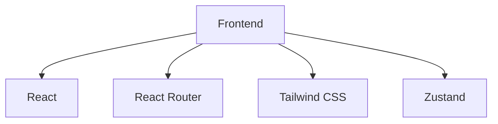

## 1. Architecture Design

## 2. Technology Description
- Frontend: React@18 + tailwindcss@3 + vite
- Initialization Tool: vite-init
- Backend: None
- Database: None (当前版本无后端

## 3. Route Definitions
| Route | Purpose |
|-------|---------|
| / | 主页，显示创建和克隆按钮 |
| /create | 创建新网站页面 |
| /clone | 克隆现有网站页面 |

## 4. API Definitions (if backend exists)
不适用

## 5. Server Architecture Diagram (if backend exists)
不适用

## 6. Data Model (if applicable)
不适用
