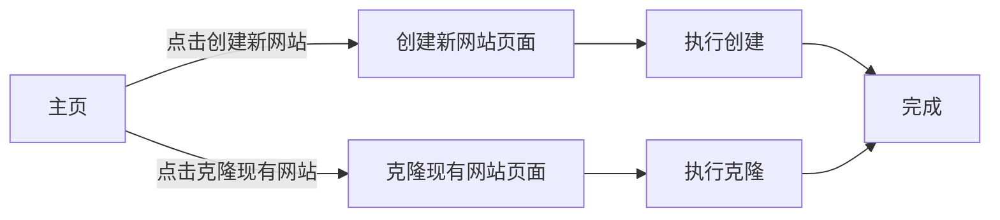

## 1. Product Overview
Thief 是一个用于克隆现有网站的工具，让用户可以轻松创建新网站或克隆现有网站。
- 主要用于快速搭建和克隆网站，解决开发人员重复造轮子的问题
- 目标用户是需要快速原型开发或网站克隆的开发者和设计师

## 2. Core Features

### 2.1 User Roles (if applicable)
| Role | Registration Method | Core Permissions |
|------|---------------------|------------------|
| Normal User | No registration required | 使用所有克隆和创建功能 |

### 2.2 Feature Module
1. **主页**: 网站操作按钮区，包含"创建新网站"和"克隆现有网站"两个主要按钮
2. **创建新网站页面**: 配置新网站的基本信息
3. **克隆现有网站页面**: 输入要克隆的网站URL并配置克隆选项

### 2.3 Page Details
| Page Name | Module Name | Feature description |
|-----------|-------------|---------------------|
| 主页 | 按钮区 | 提供"创建新网站"和"克隆现有网站"两个同等大小的蓝色按钮，水平排列 |
| 创建新网站页面 | 表单区 | 输入网站名称、描述、选择模板等 |
| 克隆现有网站页面 | URL输入区 | 输入目标网站URL，选择克隆深度和其他选项 |

## 3. Core Process
用户访问主页 → 选择"创建新网站"或"克隆现有网站" → 完成对应页面的配置 → 执行操作 → 查看结果。

## 4. User Interface Design
### 4.1 Design Style
- 主色调: 蓝色系 (#2563eb, #1d4ed8)
- 按钮风格: 圆角、扁平化、带悬浮动画
- 字体: 使用现代无衬线字体，标题用粗体，正文用常规字重
- 布局风格: 居中布局，简洁大方
- 图标风格: 使用简约的线性图标

### 4.2 Page Design Overview
| Page Name | Module Name | UI Elements |
|-----------|-------------|-------------|
| 主页 | 标题区 | 大标题、副标题，居中显示，优雅阴影 |
| 主页 | 按钮区 | 两个大小相同的蓝色按钮，水平排列，间距适中，悬浮有微动画 |
| 创建新网站页面 | 表单区 | 卡片式布局，清晰的表单字段，现代化输入框 |
| 克隆现有网站页面 | URL输入区 | 大输入框，带网站图标预览，克隆选项开关 |

### 4.3 Responsiveness
桌面端优先，响应式适配平板和移动设备，在小屏幕上按钮垂直排列。

### 4.4 3D Scene Guidance (if applicable)
不适用
